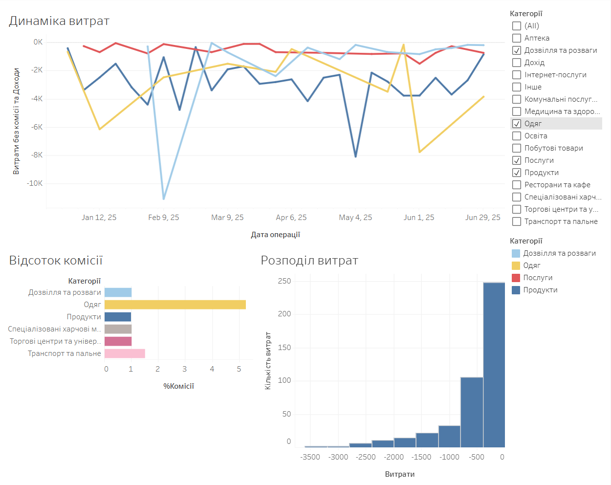

# Financial Transactions Dashboard

Google Sheets • Tableau Public • Data Cleaning • Pivot Tables • Dashboard

## Project Overview

This project was completed as part of the **Mate Academy Summer Digital Camp** and demonstrates the basic workflow of a data analysis project using **Google Sheets** and **Tableau Public**.

The project covers the complete analysis process: cleaning raw transaction data, preparing it for analysis, categorizing transactions using MCC codes, summarizing data with pivot tables, and creating an interactive dashboard to explore spending patterns.

The final dashboard provides visual insights into expense trends, commission percentages, and the distribution of transaction amounts, allowing users to analyze both overall spending and individual expense categories.

## Project Links

- **Tableau Public Dashboard:** [View Dashboard]( https://public.tableau.com/views/DAMarathonNataliiaGnitetska-Dashboard/Dashboard1?:language=en-US&:sid=&:redirect=auth&:display_count=n&:origin=viz_share_link)

- **Google Sheets Dataset:** [Open Dataset]( https://docs.google.com/spreadsheets/d/1DawK3I9tLwtAhJYdVyBosf9-mad5pKd6GxLYMpM8RHg/edit?usp=sharing
)

## Dashboard Preview

## Dataset

This project uses a **sample dataset** containing **463 financial transactions** recorded between **February and June 2025**.

Each record represents a single banking transaction and includes information such as the transaction date and time, merchant, Merchant Category Code (MCC), transaction amount, currency, exchange rate, and commission.

An additional lookup table containing **44 Merchant Category Codes (MCC)** is included in the dataset.

## Technologies & Skills

### Google Sheets

- Data cleaning
- Data transformation
- DATEVALUE()
- IF()
- VLOOKUP()
- Pivot Tables
- Conditional Formatting

### Tableau Public

- Calculated Fields
- Line Chart
- Bar Chart
- Histogram
- Interactive Dashboard
- Filters
## Data Cleaning

To ensure data quality before analysis, the dataset was cleaned by performing the following steps:

- Removed placeholder values (`-`) from the **Exchange Rate** and **Commission (UAH)** columns.
- Deleted rows containing incomplete records (missing **MCC** or **Currency** values).
- Removed invalid records with incorrect dates (year **1900**).
- Deleted anomalous records containing invalid transaction values.
- Formatted numeric columns to display two decimal places.
- Adjusted column widths and formatted the header row for better readability.

Since only a few records contained data quality issues and the correct values could not be recovered, these anomalies were removed to prevent them from affecting the analysis.

## Data Preparation

After cleaning the dataset, several transformations were applied to prepare the data for analysis:

- Extracted the transaction date from the timestamp using the **DATEVALUE()** function.
- Calculated the final transaction amount by converting foreign currency transactions to UAH and including transaction commissions using the **IF()** function.
- Categorized transactions by matching **MCC** codes with a lookup table using the **VLOOKUP()** function.

## Pivot Table Analysis

Two Pivot Tables were created in Google Sheets to perform an initial analysis of the transaction data.

### Daily Income and Expenses

Transactions were grouped by transaction date to calculate total daily income and expenses. Conditional formatting (traffic light color scale) was applied to quickly identify days with the highest expenses and income.

### Expenses by Category

Expenses were summarized by category, with transaction details added as a second grouping level. This made it possible to identify the largest spending categories and analyze which merchants contributed most to the total expenses within each category.

The Pivot Tables provided an initial overview of spending patterns and served as the foundation for building visualizations in Tableau.

## Dashboard

An interactive dashboard was built in **Tableau Public** to explore spending patterns from multiple perspectives.

The dashboard includes three visualizations:

- **Weekly Spending Trend (Line Chart)** – displays spending over time, grouped by week to improve readability. Spending categories are distinguished by color, and a category filter allows users to focus on selected categories.
- **Average Commission by Category (Horizontal Bar Chart)** – compares the average commission percentage across spending categories using a calculated field. Categories without commission data were excluded to improve clarity.
- **Expense Distribution (Histogram)** – shows how transaction amounts are distributed across 400 UAH intervals, highlighting the frequency of transactions within each spending range.

The dashboard also includes:

- An interactive category filter.
- A color legend for spending categories.
- Cross-filtering between visualizations using **Use as Filter**, allowing users to analyze a selected category across the entire dashboard.

The dashboard provides both a high-level overview of spending behavior and the ability to explore individual spending categories in greater detail.

## Key Insights

- Most transactions were small, with the highest number of expenses falling into the **0–400 UAH** range.
- Spending patterns varied across categories. Some categories showed consistent spending, while others contained isolated high-value transactions.
- Pivot tables made it easy to identify daily spending trends and summarize expenses by category.
- Adding transaction details to the category summary helped identify the merchants responsible for the largest share of spending.
- Interactive filters in Tableau allowed both an overall view of spending and a focused analysis of individual categories.

 
